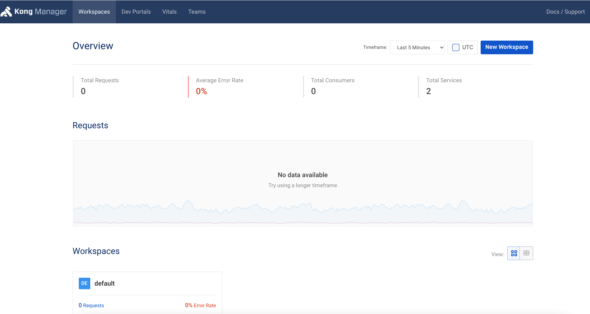
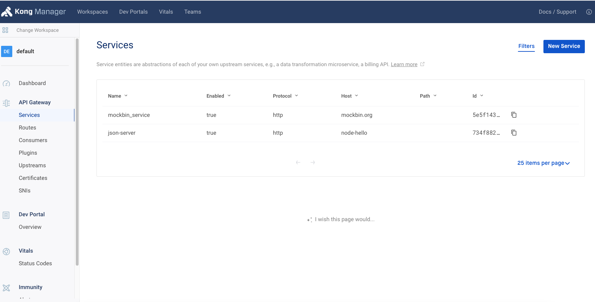

# Welcome to Kong Local

Kong Gateway is a lightweight, fast, and flexible cloud-native API gateway. An API gateway is a reverse proxy that lets you manage, configure, and route requests to your APIs.

This project is to help you setup your local copy of Kong and play around KONG using a simple node [json-server](https://github.com/typicode/json-server) API.

# Pre-requisite

- Docker
- Brew

# Setup

Setting up KONG in your local is simple. We will use one single command to setup a PostgreSQL DB, A Kong Instance and a sample node API app. Just run the command and relax!

## Step 1

```
git clone https://github.com/sanjeevkumarraob/local-kong.git
cd local-kong
```

## Step 2

If you have an enterprise kong license, copy the license.json to `local-kong` folder (repo base path). Then run,

```
./setup-local.sh
```

## Step 3

Gotcha! No more steps. Just sit and relax!

# Verify

Now open a browser and goto `http://localhost:8002` which is the admin portal for KONG.



You should be able to see there are two services available in the default workspace. The services got onboarded to kong using the `kong.yaml` file and you can check there are multiple endpoints available for these services.



To check the mockbin service, open a browser and go to `http://localhost:8000/mock` for mockbin service.

Similarly for node-hello service endpoints,

- `http://localhost:8000/profile` - for GET profile request
- `http://localhost:8000/posts` - for GET posts request
- `http://localhost:8000/comments` - for GET posts request

You can check more http methods (GET, POST, PUT, DELETE) using the same endpoints. check [json-server](https://github.com/typicode/json-server) more info.

## Postman verification

A sample postman collection has been added in `docs` folder to test the sample node-hello service. This will route all the request through kong.

# Add your service

The local setup of kong is stripped down version of enterprise solution. It doesn't have authentication/authorization enabled locally. You can onboard APIs which doesn't need authentication or a dummy stub JWT can be used in your local application testing.

To add your service, just add another block or modify the existing host block in the `kong.yaml` file.

Then run,

```
./setup-local.sh
```
